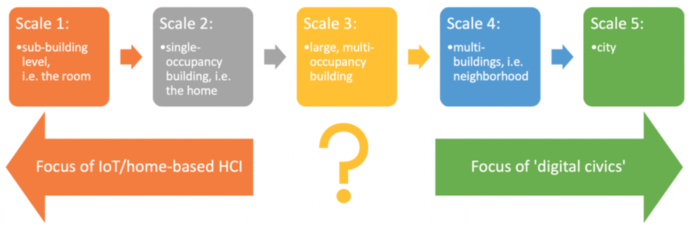

# HabiTech
## Inhabiting Buildings, Data & Technology
A one-day workshop [at CHI2020](https://chi2020.acm.org/accepted-workshops/).

25th or 26th of April 2020, Honolulu, Hawai'i, USA.

Download the full workshop paper here.

Submission deadline: **February 11th, 2020** [(CHI Extended Abstract format)](https://chi2020.acm.org/authors/chi-proceedings-format/).

Contact & submission points: [Ruth Dalton](mailto:r.dalton1@lancaster.ac.uk) & [Jakub Krukar](mailto:krukar@uni-muenster.de).

## Call for Papers
We invite submissions for a one-day workshop to help define a new research area – the building-level counterpoint to digital civics - how do new technologies enable and empower the inhabitants of a multi- occupancy buildings? This workshop will gather interdisciplinary experts in HCI, design, architecture, data ethics, and cognitive science to reflect on the role of HCI in cultivating digital civics inside buildings.
Papers should be 2-4 pages long in the [CHI Extended Abstract format](https://chi2020.acm.org/authors/chi-proceedings-format/) and may address any subjects related to the topic including but not limited to:

* Making the ongoing logging of user-behavior transparent, opt-in, and voluntary.
* Data interfaces embedded in architectural space.
* Encouraging the emergence of communities among
building users.
* User-driven building design, building management, and facility maintenance.
* Ethics of building-based personal data.
* Maintaining data privacy inside buildings, including
privacy-by-design.

The due date for submissions is (on or before) **February 11th, 2020**.

The submission site can be found at [answersonapostcardplease.com](http://answersonapostcardplease.com/). Participants will be selected based on the quality and clarity of their submissions as they reflect the interests of the workshop. 
Participants notified of acceptance: (on or before) **February 28th, 2020**. At least one author of each accepted position paper must attend the workshop, and all participants must register for both the workshop and at least one day of the conference. Participants will be selected based on their prior experience, expressed interest in the workshop and the quality of their submissions. We will focus on recruiting from a diverse group of participants.

Digital Civics | HabiTech
--- | ---
The city | The building
Citizen | Building User
Citizenship | Building occupancy, residency, ‘usership’
Community | Do "building communities" exist or is it always about individual users? Who would constitute a "building community"? People who routinely share space/tasks?
Democratic engagement | Democratic engagement
Digital technologies | Digital technologies
Citizen-driven city design | User-driven building design
Ethics | Ethics
Citizen rights | Building user rights
Privacy in public space (e.g., right not to be tracked) | Privacy in buildings (e.g. right not to have one's access logs recorded?)
Equal rights to access and use public parts of the city | Equal rights to access and use public parts of the building?
Rights to healthy environments | Rights to (mentally?) healthy buildings
(Citizen) voice | (User or inhabitant’s) voice
Community-driven digital technologies | (Building) user-driven digital technologies
Community-driven digital services | (Building) user-driven digital services
Action | Building user action
City activism (offline: guerrilla gardening / digital: citizen-built public transit apps) | building activism (offline: flexibly self-rearranging space/furniture / digital: community building)
Civic potentials of digital life | Building user potentials of digital tools
volunteered geo-information | volunteered building-level information (sensors?), reporting of faults/building repairs
city data from sensors (not always volunteered) | building data from sensors (not always volunteered)

## Schedule (tentative)
* 09:05 - 09:10: Welcome
* 09:10 - 11:00: 20 x rapid fire presentations
* 11:00 - 11:30: *Coffee break (‘domain-dotting’ activity over coffee)*
* 11:30 - 12:30: Keynote + Q&A
* 12:30 - 13:30: *Lunch*
* 13:30 - 14:30: Constructive controversy exercise
* 14:30 - 15:00: *Afternoon coffee break*
* 15:00 - 16:00: Mind-mapping/mapping the domain
* 16:00 - 17:00: Reporting back and discussion about future plans

## Accepted papers
...will be posted here

## Organizers
**Professor Ruth Conroy Dalton**, University of Lancaster, UK [(www)](https://www.lancaster.ac.uk/study/why-lancaster/architecture-meet-the-team/). Ruth is Lancaster University’s Inaugural Professor of Architecture. Her research interests are centred on the relationship between the spatial layout of buildings and environments and their effect on how people understand and interact in those spaces. She is an expert in space syntax analysis and using virtual environments as a method for researching human factors in the built environment.

**Professor Christoph Hölscher**, ETH Zurich and Singapore-ETH Future Cities Laboratory [(www)](https://cog.ethz.ch/). Christoph has been Professor of Cognitive Science at ETH Zurich since 2013. Currently a member of the Singapore-ETH Future Cities Laboratory, he is also the programme director of the Future Resilient Systems programme - the second programme at the centre. His areas of research include wayfinding, spatial cognition & usability research for architectural design, HCI, user modelling & personalisation, information retrieval & web search behaviour.

**Dr Jakub Krukar**, Institute for Geoinformatics, University of Muenster, Germany [(www)](https://krukar.staff.ifgi.de/). Jakub is a researcher and lecturer in spatial cognition - a branch of cognitive science studying how people think about, think in, and think with space. He is a psychologist by training, and he applies psychological methods in the fields of geoinformatics, architecture, and human-computer interaction.

**Assoc. Professor Nick Dalton**, University of Northumbria at Newcastle, UK [(www)](https://www.northumbria.ac.uk/about-us/our-staff/d/dr-nicholas-dalton/). Nick’s research exists in the crossover between architecture and human computer interaction. This includes areas such as space syntax in theoretical architecture. His current research area is that of very large-scale user interfaces: any user interface which is larger than a person. For example, this includes public
displays, a digital wine shop, information sculptures, table-sized multitouch group interactions etc. He is a founding member of NORSC (Northumbria’s social computing research group).

**Professor Mikael Wiberg**, Umeå University, Sweden [(www)](https://www.umu.se/personal/mikael-wiberg/). Mikael is a Professor of Informatics at Umeå university, Sweden. He is editor for the Architecture & Interaction forum for ACM Interactions, and his research interests includes a focus on interaction design at the scale of architecture, an interest in the materiality of interaction, and an interest in concept-driven design methods. He is the author of a recent book, "The Materiality of Interaction - Notes on the Materials of Interaction Design" (MIT Press, Jan 2018).

**UNStudio Architects** [(www)](https://www.unstudio.com/). UNStudio, founded in 1988 by Ben van Berkel and Caroline Bos, is an international architectural design network with four full-service international offices in Amsterdam, Shanghai, Hong Kong and Frankfurt. They specialise in architecture, interior architecture, product design, urban development and infrastructural projects.

## Institutions

